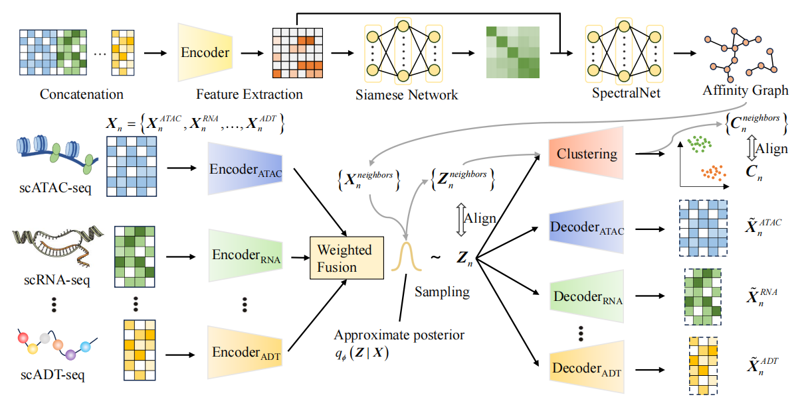

# GeDGC

## GeDGC Model

<p align="center">
  
</p>

## Input and Output Directories

The datasets used by the program are in the ```data``` folder. The output files are under the ```result``` folder and separated by the name of the dataset. i.e the results of the Chen_high are in ```result/Chen_high```.

## File description

The file descriptions are as follows:
```
graph_embedding: The files implementing the SpectralNet
module/Multi_vae.py: The file for designing the multi-omics variational autoencoder
module/classifier.py: The file for designing the classifier and Gaussian mixture models
tools/load_data.py: File for data import and data normalization
tools/Form_data.py: File for calculating neighbor nodes
tools/utils.py: File for calculating evaluation metrics
tools/early_stopping.py: File for the early stopping implementation
pretrain.py: A pre-training file for the model
train.py: A training file for the model
run.py: The main file for execution
```

## Requirements

```
python                        3.7.12
muon                          0.1.3
scanpy                        1.9.3
torch                         1.13.1
torchvision                   0.9.1+cu101
```

## Experiments

The algorithm can be run as follows:
```
python run.py
```
